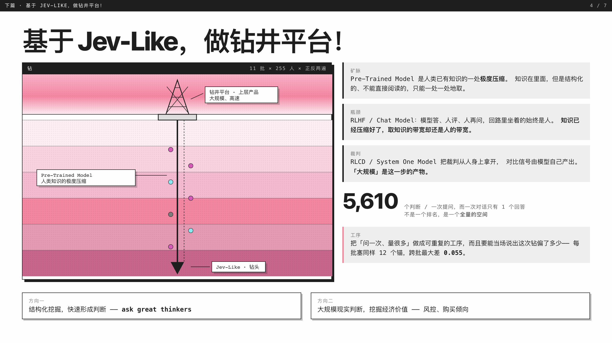

# 把一个问题，交给人类历史上的全部思想家

> 截图来自一次真实运行。唯一人工补上的是开头那句英文题干，平时它由模型自己写。

「如果有机会，我要去火星移民吗？」

丢进去一句话。它先把这句改写成一个能点头或摇头的命题——**你支持去火星移民吗？**——再问给
**全部思想家**：不分年代、不分文化圈，一个人都不落下。

**全人类的思想家，多数反对这件事。** 站在「去」那一边的只有二十几个人，而且几乎都还在世：
马斯克、霍金、贝索斯、扎克伯格；反对的一头是卡洛·波拿巴、范达娜·席瓦、嗣德帝。

先说清楚：**这不是一次投票，他们本人也从来没有被问过**——这是模型凭自己对这些人的了解
给出的判断。

## 它长成什么样

每个人一个位置，铺在地球上，按去世年切成一条时间轴，一格一百年。

**粉 = 支持，青 = 反对，点越大 = 越不在中间。** 整张图几乎是青的，只有零星的粉点。
拖着时间轴，地图、三色条、各文化圈、两头、三张名单整页跟着走——「17 世纪谁最支持」
不需要再问一次，就是同一批答案换了个切片。

按文化圈拆开，北美那一格粉色最亮，日本那一格全青。但这里也藏着这一页最该被质疑的地方：
**地图上最密的区域是名录最密的区域，不一定是意见最密的区域。**

## 它怎么用

一个输入框，一句话。你可以问任何一件在纠结的事——该不该辞掉这份工作、该不该把这句话说出口、
该不该再等一年。它不替你做决定，只让你看见这件事在别人眼里长什么样。

## 为什么要钻，不是聊天

**一次对话只有 1 个回答，一次提问是全人类各自的位置。** 预训练模型是人类知识的一处极度压缩，
知识在里面，但只能一处一处地取；聊天框把取知识的带宽留在了人身上。Jev-Like 是电钻，
产品要做的是钻井平台。

所以它把提问也掉了个头：**提问需要框架，回答不需要**。三件事不做：**不抽样**、**不检索**、
**不排名**。

## 它承认的短板

- **「全部」是框架要做到的事，还不是这份名录已经做到的。** 现在收录的是有英文维基条目的人，
  其中一半来自西欧和北美——**这个数字还在往上走**。
- **这些位置是模型对这些人的判断，不是他们本人的话。**

MIT 许可，源码在 [github.com/Ewen2015/should-i](https://github.com/Ewen2015/should-i)。

---

**把一个问题交给全人类的思想家，看答案铺开成什么形状。**
