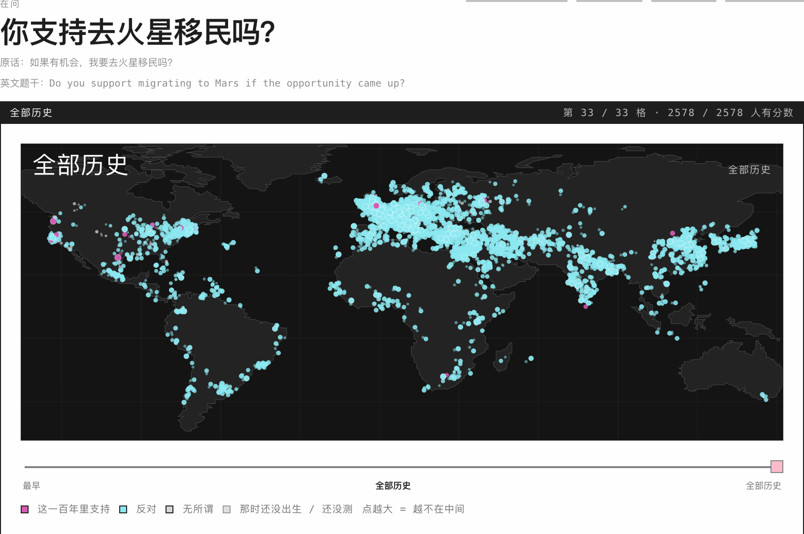
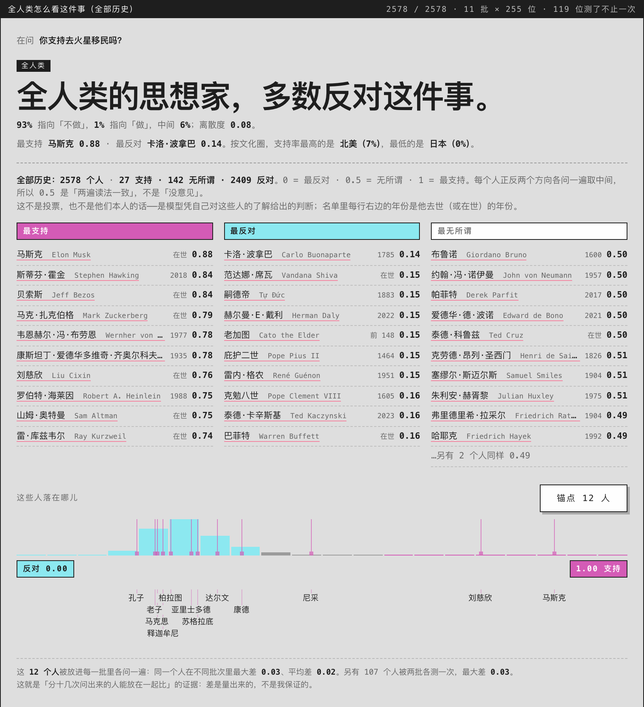
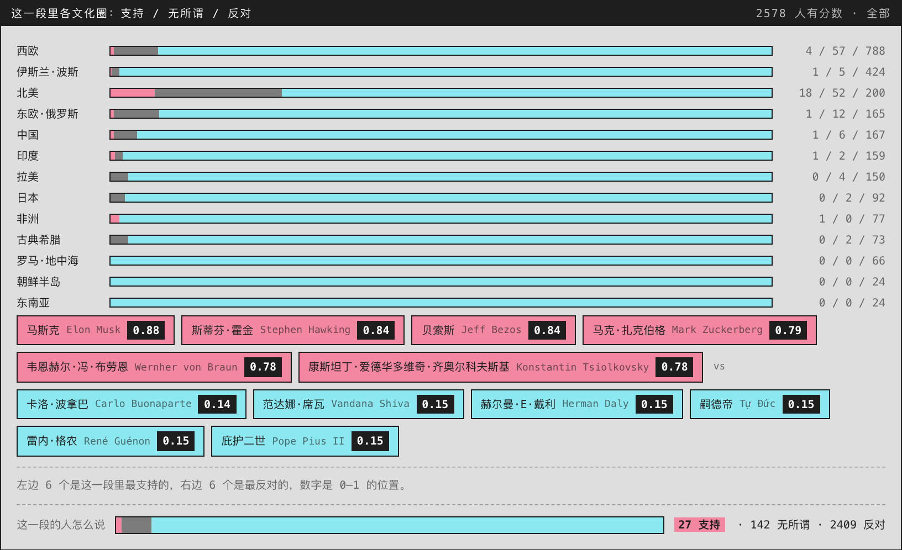

# Ask Great Thinkers: 把你的好奇心，让历史上所有思想家回答

Builder: Ewen Wang

> "我写那些艰难的事情，因为我想知道自己并不孤独，也想让你知道，你也并不孤独。"
>
> —— 美国作家 Brian Doyle

痛苦来自对自身处境的过分关注，以及对宇宙的无知。只盯着自己处境的人，会把每一件小事放大成全部；而他对宇宙知道得越少，自己那点处境就越是唯一的参照系。

人类一直在向过去要经验——一个人活 80 年，看不清任何一件大事的形状，所以要读史。但「如何高效地获得」从来没有被解决过。

互联网答应过，然后关了门。结果是信息茧房。问题不在推送算法不够好，而在问题是由你自己选的：你问自己已经相信的东西，它就还给你自己已经相信的东西。

大模型答应过，但回答你的人只有一个。提问是有门槛的动作，需要一个人自己有一套框架；缺框架的人问不出好问题，于是 chat 表面上对所有人开放，实际只对少数会提问的人有用。

所以换个方向：问题还是你的，回答问题的人不由你挑。那个困扰你的事，历史上有人按他们各自那套框架认真想过。他们一个接一个站到你面前，你这才看清他是谁、站在哪儿、为什么这么看——你认识的是他们，也是这个世界，还有你自己。

「如果有机会，我要去火星移民吗？」

把这句话丢进 Ask Great Thinkers。它会先把问题改写成一句能点头也能摇头的话：你支持去火星移民吗？然后拿这个问题去问名单上的每一个人，一个都不跳过。

## 它长成什么样

每个人一个位置，摊在地球上。再按去世年份排成一条时间轴，一格一百年。

粉色是支持，青色是反对，点越大，离中间越远。这次问下来几乎全是青色，只有零星几个粉点，北美东边几个，欧洲中间几个。

时间轴可以拖。地图、三色条、文化圈、两头、三张名单会一起跟着动。想看 17 世纪谁最支持，拖过去就行，不用再问一遍。

答案相当一致：绝大多数人反对。站在「去」这一边的只有二十几个人，而且基本是我们这代人熟悉的那几个——马斯克、霍金、贝索斯、扎克伯格。反过来的那头是卡洛·波拿巴、范达娜·席瓦、嗣德帝。

分文化圈看，北美那一格粉色最多，日本一格全青。

## 为什么要钻，不是聊天

一次对话给你一个回答，这里一次给你全人类各自的位置。预训练模型里压着人类已有的知识，压得很紧，只能一处一处地取。聊天框把取知识的速度限制在人身上，一次问一句。Jev-Like 是钻头，Ask Great Thinkers 要做的是钻井平台。

名单上的人一个不落，也不按「最像的」挑几个出来：不检索，也不排名次。

Ask Great Thinkers 是 should-i 底下的一个产品，MIT 许可，源码：github.com/Ewen2015/should-i
